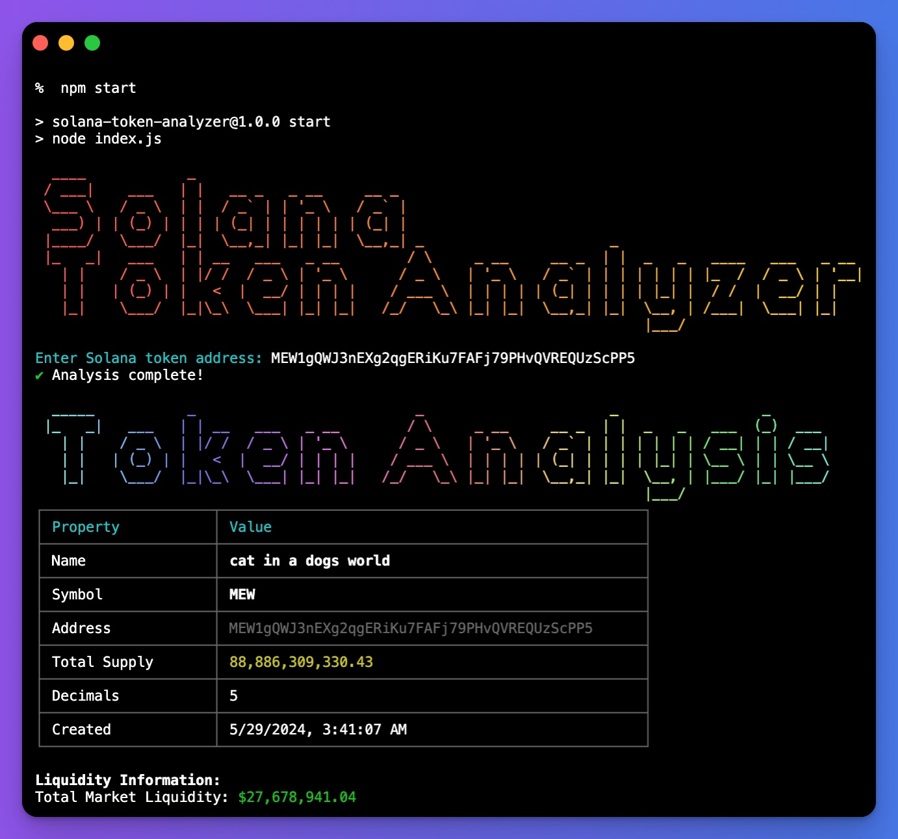
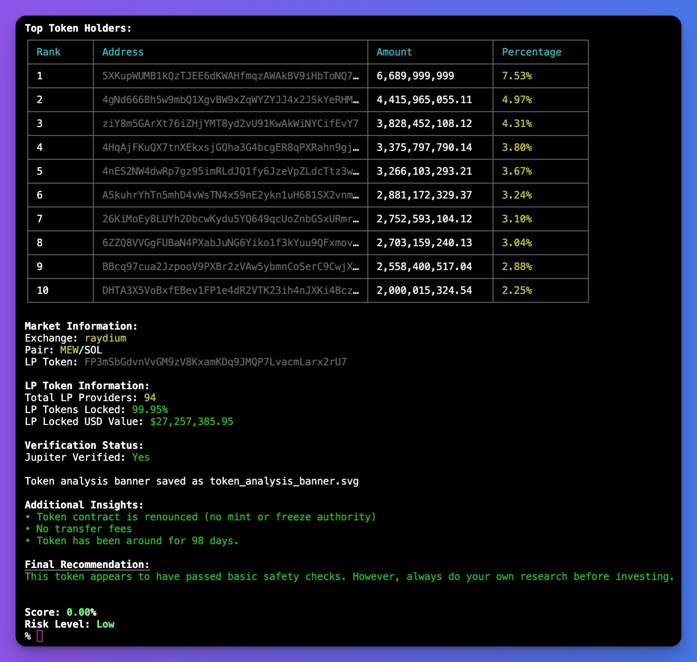

# Solana Token Analyzer

A Node.js tool for in-depth analysis of Solana tokens. This script fetches comprehensive information about a given Solana token, calculates a risk score, and provides detailed analysis results including liquidity information, top holders, and market data. It also generates visual representations of the analysis in both SVG and PNG formats.





## Features

- **Comprehensive Token Analysis**: Provides detailed information about Solana tokens.
- **Risk Assessment**: Calculates and displays a risk score and risk level.
- **Visual Representation**: Generates analysis results in both SVG and PNG formats.
- **Detailed Console Output**: Displays token information, liquidity data, top holders, and more in a user-friendly console format.
- **In-Depth Analysis**: Utilizes advanced algorithms to provide thorough token evaluation.

## Prerequisites

- **Node.js**: Ensure you have Node.js installed. You can download it from [Node.js](https://nodejs.org/).

## Installation

1. Clone the repository:

   ```bash
   git clone https://github.com/dmytrmk/solana-token-analyzer.git
   ```

2. Navigate to the project directory:

   ```bash
   cd solana-token-analyzer
   ```

3. Install the dependencies:

   ```bash
   npm install
   ```

## Usage

1. Run the Solana Token Analyzer:

   ```bash
   npm start
   ```

2. When prompted, enter the Solana token address you want to analyze.

The script will fetch the token data, perform the analysis, display the results in the console, and generate visual representations of the analysis.

## Output

The script provides:

1. Detailed console output including:

   - Token information
   - Liquidity data
   - Top token holders
   - Market information
   - Risk assessment
   - Additional insights

2. An SVG file named `token_analysis_banner.svg` containing a visual representation of the analysis results.

3. A PNG file named `[Token_Name]_analysis.png` with the same visual representation.

## Example Output

The console will display detailed information about the token, and the script will generate visual representations as shown in the screenshots above.

## Contributing

Contributions are welcome! Please open an issue or submit a pull request.

## License

This project is licensed under the MIT License. See the [LICENSE](LICENSE) file for details.

## Support

If you encounter any issues or have questions, please open an issue on GitHub or contact the maintainer via email.

## Disclaimer

This tool is for informational purposes only and should not be considered financial advice. Always do your own research before making investment decisions.
